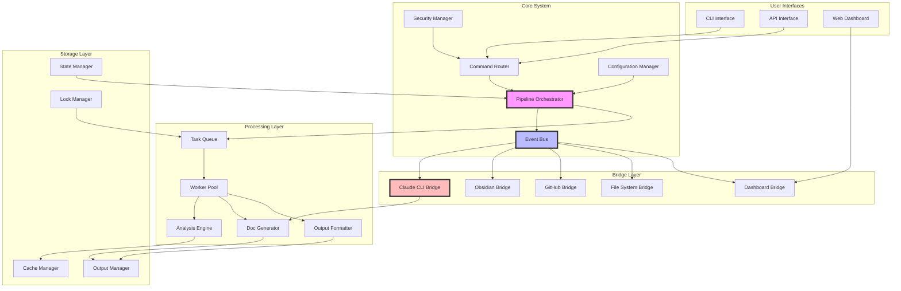
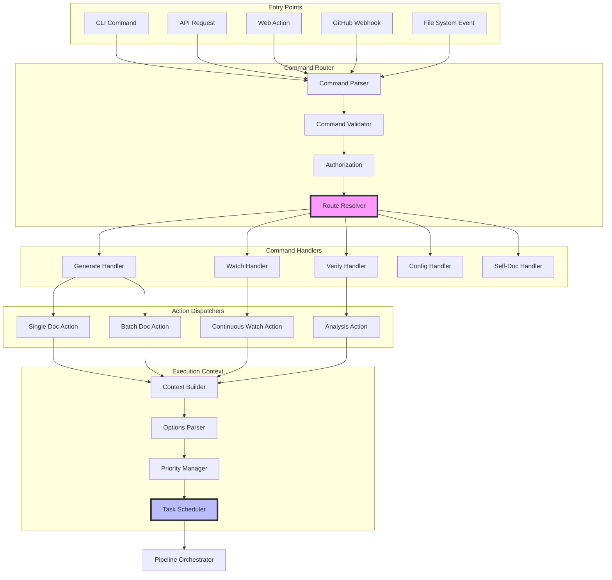
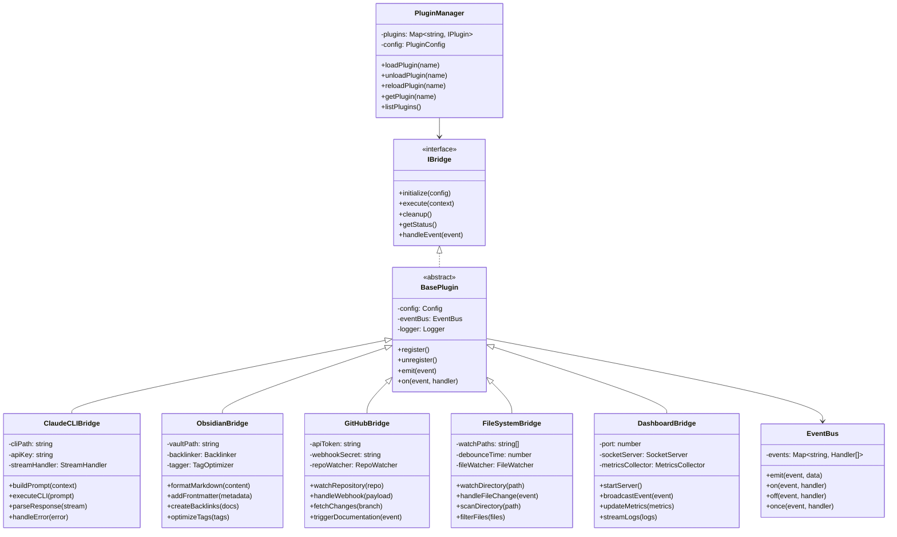
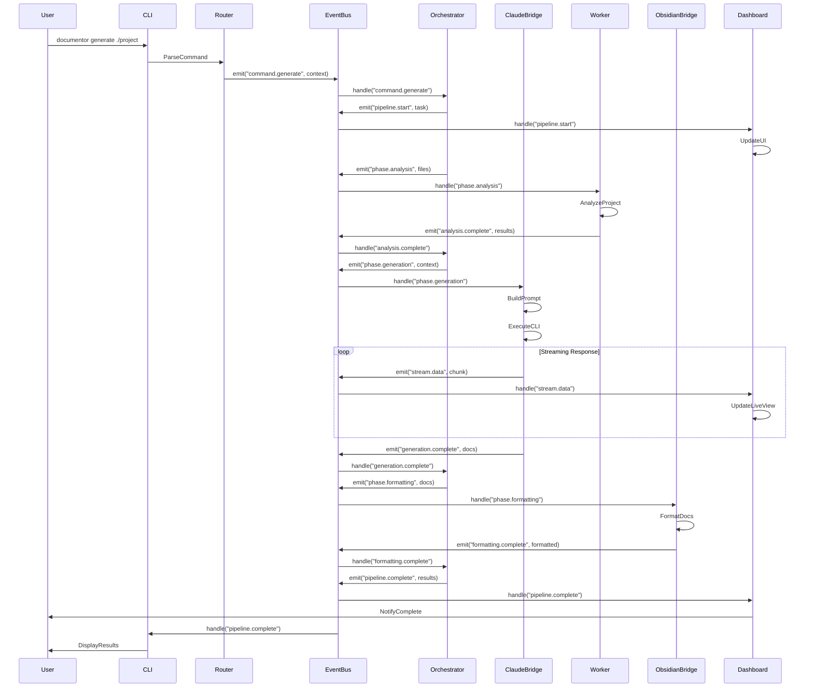
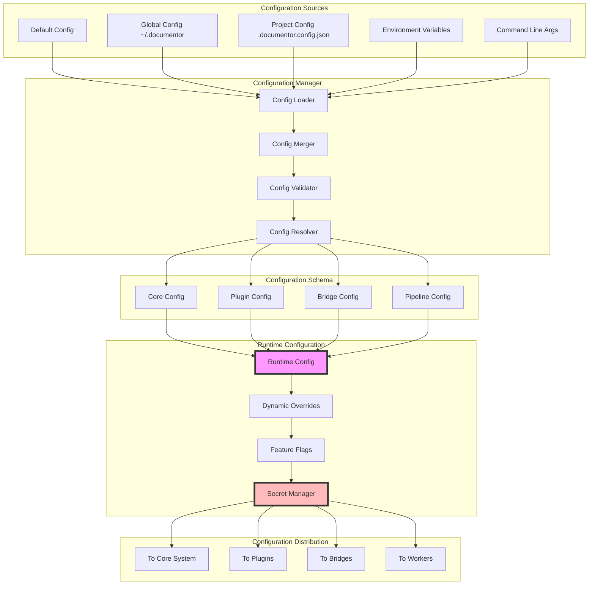
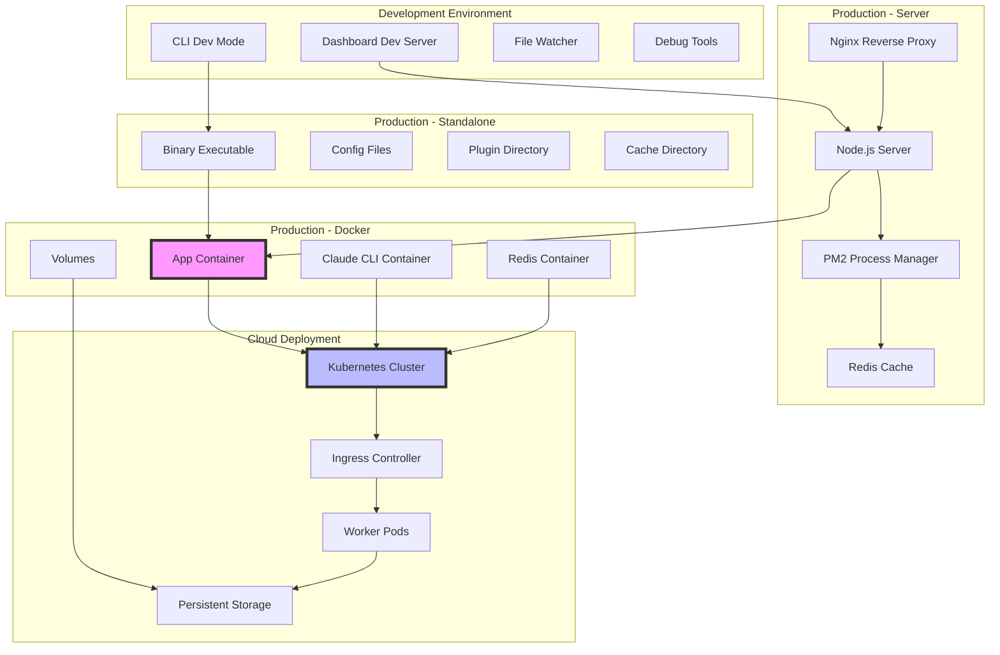
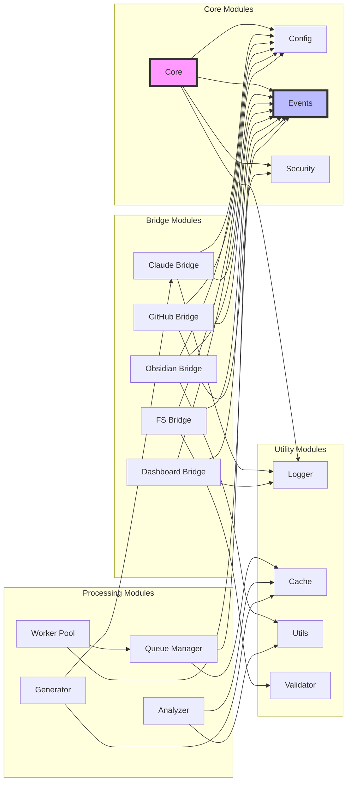
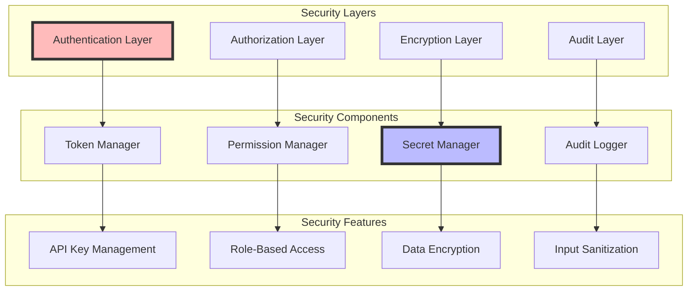

# DocuMentor Architecture Design

## Table of Contents
1. [System Overview](#system-overview)
2. [Core Architecture](#core-architecture)
3. [Data Flow Architecture](#data-flow-architecture)
4. [Processing Pipeline](#processing-pipeline)
5. [Command Routing System](#command-routing-system)
6. [Plugin/Bridge Architecture](#pluginbridge-architecture)
7. [Event-Driven Communication](#event-driven-communication)
8. [Configuration Management](#configuration-management)
9. [Deployment Architecture](#deployment-architecture)

---

## System Overview

DocuMentor is built on a modular, plugin-based architecture with clear separation of concerns. The system uses an event-driven approach with message queues for scalability and reliability.

### Key Architectural Principles
- **Modularity**: Each component is independent and replaceable
- **Extensibility**: New bridges/plugins can be added without core changes
- **Configurability**: All behavior controlled through configuration
- **Scalability**: Queue-based processing with worker pools
- **Reliability**: Error recovery, retries, and fallback mechanisms
- **Observability**: Comprehensive monitoring and logging

---

## Core Architecture



---

## Data Flow Architecture

```mermaid
flowchart LR
    subgraph "Input Sources"
        LOCAL[Local Files]
        GIT[GitHub Repos]
        WATCH[File Watcher]
        USER[User Commands]
    end

    subgraph "Input Processing"
        VALIDATOR[Input Validator]
        SCANNER[File Scanner]
        FILTER[Smart Filter]
        PRIORITIZER[Task Prioritizer]
    end

    subgraph "Queue System"
        INQUEUE[Input Queue]
        PROCQUEUE[Processing Queue]
        OUTQUEUE[Output Queue]
    end

    subgraph "Processing Pipeline"
        P1[Initialize]
        P2[Validate]
        P3[Analyze]
        P4[Prepare]
        P5[Generate]
        P6[Enhance]
        P7[Format]
        P8[Integrate]
        P9[Finalize]
    end

    subgraph "Claude Processing"
        PROMPT[Prompt Builder]
        CLAUDECLI[Claude CLI]
        PARSER[Response Parser]
        STREAM[Stream Handler]
    end

    subgraph "Output Processing"
        TRANSFORM[Transformer]
        LINKER[Link Builder]
        META[Metadata Generator]
        TAGGER[Tag Optimizer]
    end

    subgraph "Output Targets"
        MARKDOWN[Markdown Files]
        OBSIDIAN_OUT[Obsidian Vault]
        DASHBOARD[Dashboard UI]
        NOTIFICATIONS[Notifications]
    end

    LOCAL --> VALIDATOR
    GIT --> VALIDATOR
    WATCH --> VALIDATOR
    USER --> VALIDATOR

    VALIDATOR --> SCANNER
    SCANNER --> FILTER
    FILTER --> PRIORITIZER
    PRIORITIZER --> INQUEUE

    INQUEUE --> P1
    P1 --> P2
    P2 --> P3
    P3 --> P4
    P4 --> PROCQUEUE
    
    PROCQUEUE --> PROMPT
    PROMPT --> CLAUDECLI
    CLAUDECLI --> STREAM
    STREAM --> PARSER
    PARSER --> P5

    P5 --> P6
    P6 --> P7
    P7 --> P8
    P8 --> P9
    P9 --> OUTQUEUE

    OUTQUEUE --> TRANSFORM
    TRANSFORM --> LINKER
    LINKER --> META
    META --> TAGGER

    TAGGER --> MARKDOWN
    TAGGER --> OBSIDIAN_OUT
    TRANSFORM --> DASHBOARD
    P9 --> NOTIFICATIONS

    style CLAUDECLI fill:#fbb,stroke:#333,stroke-width:4px
    style PROCQUEUE fill:#bbf,stroke:#333,stroke-width:4px
```



---

## Processing Pipeline

```mermaid
stateDiagram-v2
    [*] --> Initialization
    
    state Initialization {
        [*] --> LoadConfig
        LoadConfig --> SetupEnvironment
        SetupEnvironment --> CreateQueues
        CreateQueues --> InitializeBridges
    }
    
    Initialization --> Validation
    
    state Validation {
        [*] --> CheckPermissions
        CheckPermissions --> ValidateInput
        ValidateInput --> VerifyDependencies
        VerifyDependencies --> SecurityCheck
    }
    
    Validation --> Analysis
    
    state Analysis {
        [*] --> ScanProject
        ScanProject --> DetectType
        DetectType --> MapStructure
        MapStructure --> AnalyzeComplexity
        AnalyzeComplexity --> IdentifyCritical
    }
    
    Analysis --> Preparation
    
    state Preparation {
        [*] --> BuildContext
        BuildContext --> PreparePrompts
        PreparePrompts --> AllocateWorkers
        AllocateWorkers --> SetupCache
    }
    
    Preparation --> Generation
    
    state Generation {
        [*] --> CallClaude
        CallClaude --> StreamResponse
        StreamResponse --> ParseOutput
        ParseOutput --> ValidateGeneration
        
        state CallClaude {
            [*] --> BuildPrompt
            BuildPrompt --> ExecuteCLI
            ExecuteCLI --> HandleStream
        }
    }
    
    Generation --> Enhancement
    
    state Enhancement {
        [*] --> AddMetadata
        AddMetadata --> CreateBacklinks
        CreateBacklinks --> OptimizeTags
        OptimizeTags --> GenerateMOC
    }
    
    Enhancement --> Formatting
    
    state Formatting {
        [*] --> ApplyTemplate
        ApplyTemplate --> FormatMarkdown
        FormatMarkdown --> AddFrontmatter
        AddFrontmatter --> InsertDiagrams
    }
    
    Formatting --> Integration
    
    state Integration {
        [*] --> ObsidianIntegration
        ObsidianIntegration --> DashboardUpdate
        DashboardUpdate --> GitHubSync
        GitHubSync --> NotificationSend
    }
    
    Integration --> Finalization
    
    state Finalization {
        [*] --> SaveFiles
        SaveFiles --> UpdateCache
        UpdateCache --> CleanupTemp
        CleanupTemp --> LogCompletion
    }
    
    Finalization --> [*]
```



---

## Command Routing System



---

## Plugin/Bridge Architecture



---

## Event-Driven Communication



---

## Configuration Management



---

## Deployment Architecture



---

## Module Dependencies



---

## Extension Points

### Adding New Bridges
1. Implement `IBridge` interface
2. Register with `PluginManager`
3. Configure in `.documentor.config.json`
4. Handle events from `EventBus`

### Adding New Phases
1. Extend `PipelinePhase` class
2. Register in `PipelineConfig`
3. Define phase dependencies
4. Implement phase logic

### Adding New Output Formats
1. Create formatter class
2. Register with `OutputManager`
3. Define transformation rules
4. Configure templates

### Custom Workers
1. Extend `BaseWorker` class
2. Register with `WorkerPool`
3. Define task types handled
4. Implement processing logic

---

## Configuration Example

```json
{
  "core": {
    "version": "1.0.0",
    "workers": 4,
    "timeout": 300000,
    "retries": 3
  },
  "bridges": {
    "claude": {
      "enabled": true,
      "cliPath": "/usr/local/bin/claude",
      "dangerouslySkipPermissions": false,
      "streamJson": true
    },
    "obsidian": {
      "enabled": true,
      "vaultPath": "~/Documents/Obsidian",
      "generateBacklinks": true,
      "optimizeTags": true
    },
    "github": {
      "enabled": false,
      "token": "${GITHUB_TOKEN}",
      "webhookSecret": "${WEBHOOK_SECRET}"
    },
    "dashboard": {
      "enabled": true,
      "port": 3333,
      "autoOpen": true
    }
  },
  "pipeline": {
    "phases": [
      "initialization",
      "validation",
      "analysis",
      "preparation",
      "generation",
      "enhancement",
      "formatting",
      "integration",
      "finalization"
    ],
    "parallel": true,
    "cacheEnabled": true
  },
  "output": {
    "format": "obsidian",
    "path": "./docs",
    "templates": "./templates",
    "overwrite": false
  }
}
```

---

## Scalability Considerations

1. **Horizontal Scaling**: Add more worker pods in Kubernetes
2. **Vertical Scaling**: Increase worker pool size
3. **Cache Strategy**: Redis for distributed caching
4. **Queue Management**: RabbitMQ or Redis for job queuing
5. **Load Balancing**: Nginx for API/Dashboard distribution
6. **Database**: PostgreSQL for metadata and state management
7. **Monitoring**: Prometheus + Grafana for metrics
8. **Logging**: ELK stack for centralized logging

---

## Security Architecture



---

## Performance Optimization

1. **Caching Strategy**
   - LRU cache for frequently accessed data
   - Redis for distributed cache
   - File system cache for generated docs

2. **Queue Optimization**
   - Priority queues for urgent tasks
   - Batch processing for similar tasks
   - Dead letter queues for failed tasks

3. **Worker Management**
   - Dynamic worker scaling
   - Task affinity for specialized workers
   - Resource pooling for efficiency

4. **Stream Processing**
   - Chunked file reading
   - Stream-based Claude CLI responses
   - Progressive rendering in dashboard

---

## Testing Strategy

1. **Unit Tests**: Individual component testing
2. **Integration Tests**: Bridge and plugin testing
3. **E2E Tests**: Full pipeline testing
4. **Performance Tests**: Load and stress testing
5. **Security Tests**: Penetration and vulnerability testing

---

## Future Extensibility

### Planned Extensions
1. **AI Models**: Support for other AI providers
2. **Cloud Storage**: S3, GCS, Azure Blob integration
3. **CI/CD**: Jenkins, GitLab CI, GitHub Actions plugins
4. **IDE Plugins**: VSCode, IntelliJ extensions
5. **API Gateway**: GraphQL support
6. **Webhooks**: Custom webhook integrations
7. **Notifications**: Slack, Discord, Email bridges
8. **Analytics**: Usage analytics and reporting

### Extension Framework
- Plugin marketplace
- Plugin versioning
- Dependency management
- Auto-update mechanism
- Plugin sandboxing
- Resource limits

---

**Architecture Version**: 1.0.0  
**Last Updated**: 2024  
**Status**: Active Development