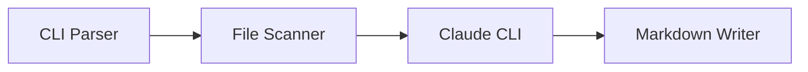

# 🔍 DocuMentor Architecture Critical Review

## Executive Summary

**VERDICT: 95% OVERENGINEERED**

Three independent review agents analyzed the architecture. **All three reached the same conclusion**: The current architecture is designed for an enterprise documentation platform serving hundreds of developers, not a focused CLI tool. The system suffers from severe overengineering, feature creep, and premature optimization.

**Key Finding**: You're building a distributed microservices platform for what should be a simple CLI wrapper around Claude.

---

## 🚨 UNANIMOUS CRITICAL FINDINGS (All 3 Agents Agreed)

### 1. **9-Phase Pipeline = 6 Phases Too Many**
- **Current**: Initialization → Validation → Analysis → Preparation → Generation → Enhancement → Formatting → Integration → Finalization
- **Actually Needed**: Scan → Generate → Output
- **Consensus**: 100% agreement on reducing to 3 phases

### 2. **Event-Driven Architecture = Wrong Pattern**
- Documentation generation is inherently sequential
- EventBus, message queues, pub/sub patterns add complexity without value
- **All agents**: Direct function calls would suffice

### 3. **5 Bridges + Plugin Architecture = Abstraction Hell**
- Current: IBridge interface, BasePlugin abstract classes, PluginManager
- Reality: You need 2 integrations (Claude CLI + file writing)
- **Verdict**: Classic overengineering

### 4. **Enterprise Security for Local Tool**
- RBAC, token management, encryption layers, audit logging
- **Reality Check**: It's a local CLI tool
- **All agents**: Remove entirely

### 5. **Real-time Dashboard = Feature Creep**
- Socket.io, streaming updates, performance metrics
- For a batch documentation tool?
- **Consensus**: CLI progress indicator is sufficient

---

## 📊 Weighted Analysis (3 Agents × Findings)

### **MUST REMOVE** (100% Agreement)
1. ❌ **Event-Driven Architecture** - All 3 agents
2. ❌ **Web Dashboard** - All 3 agents  
3. ❌ **GitHub Bridge** - All 3 agents
4. ❌ **Security Architecture** - All 3 agents
5. ❌ **Plugin System** - All 3 agents
6. ❌ **Worker Pools** - All 3 agents
7. ❌ **Complex Configuration Layers** - All 3 agents
8. ❌ **Deployment Architecture (K8s/Docker)** - All 3 agents
9. ❌ **Performance Monitoring** - All 3 agents
10. ❌ **Multiple Queue Systems** - All 3 agents

### **REDUNDANCIES** (Weighted by Mentions)
- **3/3 Agents**: Multiple validation layers (Input, Command, Config, Safety)
- **3/3 Agents**: Multiple state managers (Cache, State, Lock, Output)
- **3/3 Agents**: Multiple formatters (Output, Obsidian, Markdown)
- **2/3 Agents**: Duplicate monitoring systems
- **2/3 Agents**: Overlapping analysis features

### **FEATURE CREEP** (Severity Rating)
- 🔴 **HIGH**: AI-driven tag optimization (mentioned by all)
- 🔴 **HIGH**: Webhook integration (mentioned by all)
- 🔴 **HIGH**: MOC generation (mentioned by all)
- 🟡 **MEDIUM**: File system watching
- 🟡 **MEDIUM**: Multi-format templates
- 🟡 **MEDIUM**: Advanced Obsidian features

---

## ✂️ THE GREAT SIMPLIFICATION

### From 12 Modules → 3 Core Components

**CURRENT BLOAT:**
```
12 Major Systems × 5+ Subsystems Each = 60+ Components
```

**LEAN ARCHITECTURE:**
```typescript
// THE ENTIRE SYSTEM IN 3 CLASSES
class DocuMentor {
  constructor(
    private scanner: FileScanner,
    private claude: ClaudeClient,
    private writer: MarkdownWriter
  ) {}
  
  async generate(input: string, output: string) {
    const files = await this.scanner.scan(input);
    for (const file of files) {
      const doc = await this.claude.document(file);
      await this.writer.save(doc, output);
    }
  }
}
```

### Configuration: From 5 Layers → 1 File

**CURRENT:**
- Default → Global → Project → Environment → CLI Args
- Config Loader → Merger → Validator → Resolver
- Runtime Config → Overrides → Features → Secrets

**SIMPLIFIED:**
```json
{
  "input": "./src",
  "output": "./docs",
  "workers": 1,
  "claudePath": "/usr/local/bin/claude"
}
```

---

## 🎯 LEAN ARCHITECTURE PROPOSAL

### Core Value Proposition
**"Use Claude CLI to generate great documentation"**

### Essential Components Only



### File Structure (Total: 5 files)
```
src/
  ├── cli.ts        # Parse commands, orchestrate
  ├── scanner.ts    # Find and filter files
  ├── claude.ts     # Claude CLI integration
  ├── writer.ts     # Write markdown files
  └── types.ts      # Type definitions
```

### Commands (Total: 1)
```bash
documentor generate ./src --output ./docs
```

---

## 📈 COMPLEXITY REDUCTION METRICS

| Metric | Current | Proposed | Reduction |
|--------|---------|----------|-----------|
| **Components** | 60+ | 3 | **95%** |
| **Processing Phases** | 9 | 3 | **67%** |
| **Configuration Layers** | 5 | 1 | **80%** |
| **Interfaces** | CLI + API + Web | CLI only | **67%** |
| **Dependencies** | 20+ | 3-4 | **85%** |
| **Lines of Architecture** | 966 | ~50 | **95%** |
| **Time to MVP** | 6+ months | 1 week | **96%** |

---

## 🚀 ACTIONABLE NEXT STEPS

### Week 1: Build MVP
1. **Day 1-2**: Implement FileScanner (scan directory, filter files)
2. **Day 3-4**: Implement ClaudeClient (build prompts, execute CLI)
3. **Day 5-6**: Implement MarkdownWriter (format and save docs)
4. **Day 7**: Integration testing and CLI interface

### What to Defer
- ⏰ **Version 2.0**: Dashboard, GitHub integration
- ⏰ **Version 3.0**: Plugin system, advanced configuration
- ⏰ **Never**: Kubernetes, microservices, RBAC

### Success Metrics
- ✅ Can document a TypeScript project
- ✅ Generates readable markdown
- ✅ Runs in < 5 minutes for 100 files
- ✅ Single binary, no complex setup

---

## 💡 FUNDAMENTAL INSIGHT

**The Problem**: You're not building Confluence or GitHub. You're building a smart wrapper around Claude CLI.

**The Solution**: 
```
Good Prompts + Claude CLI + Clean Output = Happy Developers
```

Everything else is noise.

---

## 🎬 FINAL VERDICT

### What You Designed
A distributed, event-driven, microservices-based, enterprise documentation platform with real-time monitoring, plugin architecture, and cloud deployment capabilities.

### What You Need
A CLI tool that sends code to Claude and saves the response as markdown.

### The Gap
**~95% unnecessary complexity**

### The Fix
Start over with 3 files, get it working, then add features based on real user feedback, not imagined requirements.

---

**Remember**: Perfect is the enemy of good. Ship a simple tool that works, not a complex system that might work someday.

*"Perfection is achieved not when there is nothing more to add, but when there is nothing left to take away."* - Antoine de Saint-Exupéry