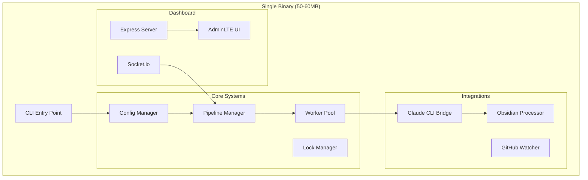

# 📋 DocuMentor Implementation Plan

## 🎯 Project Overview

Building a **CLI-first documentation generator** using Claude CLI with:
- Single self-contained binary distribution
- Embedded AdminLTE dashboard for monitoring
- Advanced Obsidian integration
- Concurrent processing with worker pools
- Lock files and state management

### **Target Architecture**



---

## 📚 Technology Stack

| Component | Technology | Size | Purpose |
|-----------|------------|------|---------|
| **Language** | TypeScript | - | Type safety & maintainability |
| **Runtime** | Node.js 20+ | 40MB | JavaScript runtime |
| **CLI Framework** | Commander.js | 50KB | CLI argument parsing |
| **Dashboard UI** | AdminLTE 3.2 | 2MB | Professional admin interface |
| **Dashboard Server** | Express 4.x | 200KB | HTTP server |
| **Real-time Updates** | Socket.io 4.x | 400KB | WebSocket communication |
| **Claude Integration** | Child Process | Built-in | Claude CLI execution |
| **Config Management** | JSON + dotenv | 20KB | Configuration handling |
| **Binary Bundler** | pkg / nexe | - | Single executable creation |
| **Testing** | Jest + Supertest | Dev only | Unit & integration tests |

---

## 🏗️ Implementation Phases

### **Phase Structure**
Each phase builds on the previous one with clear deliverables and testing milestones.

```
Foundation → Core → Integration → Enhancement → Polish → Production
```

---

## 📝 PHASE 1: PROJECT FOUNDATION

### **Goal**: Set up project structure and basic CLI

### Steps:

- [ ] **1.1 Initialize Project**
  ```bash
  mkdir documentor && cd documentor
  npm init -y
  npm install typescript @types/node ts-node
  npx tsc --init
  ```

- [ ] **1.2 Configure TypeScript**
  ```json
  {
    "compilerOptions": {
      "target": "ES2022",
      "module": "commonjs",
      "lib": ["ES2022"],
      "outDir": "./dist",
      "rootDir": "./src",
      "strict": true,
      "esModuleInterop": true,
      "skipLibCheck": true,
      "forceConsistentCasingInFileNames": true,
      "resolveJsonModule": true
    }
  }
  ```

- [ ] **1.3 Create Directory Structure**
  ```
  documentor/
  ├── src/
  │   ├── cli/
  │   │   └── index.ts
  │   ├── core/
  │   ├── integrations/
  │   ├── dashboard/
  │   └── utils/
  ├── templates/
  ├── tests/
  └── package.json
  ```

- [ ] **1.4 Install Core Dependencies**
  ```bash
  npm install commander dotenv winston
  npm install @types/commander --save-dev
  ```

- [ ] **1.5 Create Basic CLI Entry Point**
  ```typescript
  // src/cli/index.ts
  import { Command } from 'commander';
  
  const program = new Command();
  program
    .name('documentor')
    .description('Documentation generator using Claude CLI')
    .version('0.1.0');
    
  program
    .command('generate <input>')
    .description('Generate documentation')
    .option('-o, --output <path>', 'output directory', './docs')
    .action((input, options) => {
      console.log(`Generating docs for ${input}`);
    });
    
  program.parse();
  ```

- [ ] **1.6 Create NPM Scripts**
  ```json
  {
    "scripts": {
      "dev": "ts-node src/cli/index.ts",
      "build": "tsc",
      "start": "node dist/cli/index.js"
    }
  }
  ```

### 🎯 **MILESTONE 1: Basic CLI Running**
**Test**: Run `npm run dev generate ./test` and see output
**Deliverable**: Working CLI that accepts commands

---

## 📝 PHASE 2: CONFIGURATION SYSTEM

### **Goal**: Implement configuration management

### Steps:

- [ ] **2.1 Create Config Types**
  ```typescript
  // src/types/config.ts
  interface DocuMentorConfig {
    paths: {
      input: string[];
      output: string;
      templates: string;
    };
    claude: {
      path: string;
      model: string;
      dangerouslySkipPermissions: boolean;
    };
    processing: {
      workers: number;
      timeout: number;
      retries: number;
    };
    obsidian: ObsidianConfig;
    dashboard: DashboardConfig;
  }
  ```

- [ ] **2.2 Implement Config Manager**
  ```typescript
  // src/core/Config.ts
  class ConfigManager {
    private config: DocuMentorConfig;
    
    async load(): Promise<void> {
      // Load from .documentor.json
      // Merge with environment variables
      // Validate configuration
    }
    
    get<K extends keyof DocuMentorConfig>(key: K): DocuMentorConfig[K]
  }
  ```

- [ ] **2.3 Create Default Configuration**
  ```json
  // .documentor.json
  {
    "paths": {
      "input": ["./src"],
      "output": "./docs",
      "templates": "./templates"
    },
    "claude": {
      "path": "/usr/local/bin/claude",
      "model": "claude-3-opus",
      "dangerouslySkipPermissions": false
    }
  }
  ```

- [ ] **2.4 Add Environment Variable Support**
  ```typescript
  // Support for:
  // DOCUMENTOR_CLAUDE_PATH
  // DOCUMENTOR_OUTPUT_PATH
  // GITHUB_TOKEN
  ```

- [ ] **2.5 Create Config Validation**
  ```typescript
  // Validate paths exist
  // Validate Claude CLI is accessible
  // Check permissions
  ```

### 🎯 **MILESTONE 2: Configuration Loading**
**Test**: Create `.documentor.json` and verify it loads
**Deliverable**: Config system that merges file + env vars

---

## 📝 PHASE 3: CLAUDE CLI INTEGRATION

### **Goal**: Integrate with Claude CLI for documentation generation

### Steps:

- [ ] **3.1 Create Claude Client Types**
  ```typescript
  interface ClaudeRequest {
    file: string;
    content: string;
    prompt: string;
  }
  
  interface ClaudeResponse {
    documentation: string;
    metadata: any;
  }
  ```

- [ ] **3.2 Implement Claude CLI Bridge**
  ```typescript
  // src/integrations/ClaudeClient.ts
  class ClaudeClient {
    async document(file: string): Promise<string> {
      // Build prompt
      // Execute Claude CLI
      // Parse response
      // Handle errors & retries
    }
  }
  ```

- [ ] **3.3 Create Prompt Templates**
  ```typescript
  // templates/prompts/documentation.md
  const DOCUMENTATION_PROMPT = `
  Generate comprehensive documentation for this code:
  - Purpose and functionality
  - API/Interface documentation
  - Usage examples
  - Dependencies
  `;
  ```

- [ ] **3.4 Implement CLI Execution**
  ```typescript
  import { spawn } from 'child_process';
  
  async executeClaude(prompt: string): Promise<string> {
    const claude = spawn('claude', [
      '--print',
      '--json-stream',
      prompt
    ]);
    // Handle streaming response
    // Parse JSON stream
  }
  ```

- [ ] **3.5 Add Error Handling & Retries**
  ```typescript
  // Implement exponential backoff
  // Handle rate limits
  // Log errors appropriately
  ```

### 🎯 **MILESTONE 3: Claude Integration Working**
**Test**: Generate documentation for a single file
**Deliverable**: Can call Claude CLI and get documentation

---

## 📝 PHASE 4: FILE PROCESSING PIPELINE

### **Goal**: Implement the 5-phase processing pipeline

### Steps:

- [ ] **4.1 Create Pipeline Manager**
  ```typescript
  // src/core/Pipeline.ts
  enum Phase {
    DISCOVERY = 'discovery',
    ANALYSIS = 'analysis', 
    GENERATION = 'generation',
    ENHANCEMENT = 'enhancement',
    OUTPUT = 'output'
  }
  
  class Pipeline {
    async execute(input: string): Promise<void> {
      await this.discovery(input);
      await this.analysis();
      await this.generation();
      await this.enhancement();
      await this.output();
    }
  }
  ```

- [ ] **4.2 Implement File Scanner (Discovery)**
  ```typescript
  // src/utils/FileScanner.ts
  class FileScanner {
    async scan(path: string): Promise<FileInfo[]> {
      // Find all code files
      // Filter by extensions
      // Respect .gitignore
      // Return file list with metadata
    }
  }
  ```

- [ ] **4.3 Implement Analysis Phase**
  ```typescript
  // Analyze project structure
  // Detect project type
  // Map dependencies
  // Identify entry points
  ```

- [ ] **4.4 Implement Generation Phase**
  ```typescript
  // Process files through Claude
  // Track progress
  // Handle errors
  // Store results
  ```

- [ ] **4.5 Implement Output Phase**
  ```typescript
  // Write markdown files
  // Create directory structure
  // Generate index/TOC
  ```

### 🎯 **MILESTONE 4: Basic Pipeline Working**
**Test**: Process a small project (5-10 files)
**Deliverable**: End-to-end documentation generation

---

## 📝 PHASE 5: WORKER POOL & CONCURRENCY

### **Goal**: Add concurrent processing for large repositories

### Steps:

- [ ] **5.1 Create Worker Pool Manager**
  ```typescript
  // src/core/WorkerPool.ts
  class WorkerPool {
    private workers: Worker[] = [];
    private queue: FileTask[] = [];
    
    constructor(size: number = 4) {
      this.initializeWorkers(size);
    }
    
    async process(files: string[]): Promise<void> {
      // Distribute files to workers
      // Track progress
      // Handle failures
    }
  }
  ```

- [ ] **5.2 Implement Worker Threads**
  ```typescript
  // src/core/Worker.ts
  import { Worker } from 'worker_threads';
  
  class DocumentWorker {
    async processFile(file: string): Promise<Documentation> {
      // Process single file
      // Report progress
      // Handle errors
    }
  }
  ```

- [ ] **5.3 Add Progress Tracking**
  ```typescript
  interface Progress {
    total: number;
    completed: number;
    current: string;
    phase: Phase;
    workers: WorkerStatus[];
  }
  ```

- [ ] **5.4 Implement Queue Management**
  ```typescript
  // Priority queue for files
  // Load balancing
  // Failure recovery
  ```

- [ ] **5.5 Add Concurrency Controls**
  ```typescript
  // Configurable worker count
  // Memory management
  // Rate limiting for Claude API
  ```

### 🎯 **MILESTONE 5: Concurrent Processing**
**Test**: Process 50+ files with 4 workers
**Deliverable**: Faster processing with progress tracking

---

## 📝 PHASE 6: LOCK FILES & STATE MANAGEMENT

### **Goal**: Prevent conflicts and enable resume capability

### Steps:

- [ ] **6.1 Implement Lock File System**
  ```typescript
  // src/core/LockManager.ts
  class LockManager {
    private lockFile = '.documentor.lock';
    
    async acquire(): Promise<Lock> {
      // Check for existing lock
      // Create lock with PID
      // Handle stale locks
    }
    
    async release(): Promise<void> {
      // Remove lock file
      // Cleanup
    }
  }
  ```

- [ ] **6.2 Create State Tracker**
  ```typescript
  // src/utils/StateTracker.ts
  interface State {
    phase: Phase;
    processed: string[];
    failed: string[];
    remaining: string[];
    startTime: Date;
    lastUpdate: Date;
  }
  ```

- [ ] **6.3 Implement Resume Capability**
  ```typescript
  // Save state periodically
  // Detect interrupted sessions
  // Resume from last checkpoint
  ```

- [ ] **6.4 Add Conflict Detection**
  ```typescript
  // Check for running instances
  // Warn about conflicts
  // Force unlock option
  ```

- [ ] **6.5 Create State Persistence**
  ```typescript
  // Save to .documentor.state
  // JSON format for debugging
  // Cleanup on completion
  ```

### 🎯 **MILESTONE 6: State Management**
**Test**: Interrupt process and resume
**Deliverable**: Lock files preventing conflicts, resume capability

---

## 📝 PHASE 7: DASHBOARD FOUNDATION

### **Goal**: Set up Express server with AdminLTE

### Steps:

- [ ] **7.1 Install Dashboard Dependencies**
  ```bash
  npm install express socket.io admin-lte@3.2
  npm install @types/express @types/socket.io --save-dev
  ```

- [ ] **7.2 Create Express Server**
  ```typescript
  // src/dashboard/server.ts
  import express from 'express';
  import { Server } from 'socket.io';
  
  class DashboardServer {
    private app: express.Application;
    private io: Server;
    
    async start(port: number = 3333): Promise<void> {
      this.app = express();
      this.setupRoutes();
      this.setupSocketIO();
      
      this.app.listen(port, () => {
        console.log(`Dashboard at http://localhost:${port}`);
      });
    }
  }
  ```

- [ ] **7.3 Set Up AdminLTE Assets**
  ```typescript
  // Copy AdminLTE dist files
  // Set up static serving
  app.use('/assets', express.static('node_modules/admin-lte/dist'));
  ```

- [ ] **7.4 Create Dashboard HTML Template**
  ```html
  <!-- src/dashboard/static/index.html -->
  <!DOCTYPE html>
  <html>
  <head>
    <title>DocuMentor Dashboard</title>
    <link rel="stylesheet" href="/assets/css/adminlte.min.css">
  </head>
  <body class="hold-transition sidebar-mini">
    <div class="wrapper">
      <!-- Dashboard content -->
    </div>
    <script src="/socket.io/socket.io.js"></script>
    <script src="/assets/js/adminlte.min.js"></script>
  </body>
  </html>
  ```

- [ ] **7.5 Implement Socket.IO Connection**
  ```typescript
  io.on('connection', (socket) => {
    console.log('Dashboard connected');
    
    socket.on('getStatus', () => {
      socket.emit('status', this.getStatus());
    });
  });
  ```

### 🎯 **MILESTONE 7: Dashboard Running**
**Test**: Run `documentor dashboard` and open browser
**Deliverable**: AdminLTE dashboard loading at localhost:3333

---

## 📝 PHASE 8: DASHBOARD UI COMPONENTS

### **Goal**: Build the monitoring interface

### Steps:

- [ ] **8.1 Create Progress Overview Widget**
  ```html
  <div class="info-box">
    <span class="info-box-icon bg-info">
      <i class="fas fa-cog fa-spin"></i>
    </span>
    <div class="info-box-content">
      <span class="info-box-text">Overall Progress</span>
      <span class="info-box-number">76%</span>
      <div class="progress">
        <div class="progress-bar" style="width: 76%"></div>
      </div>
      <span class="progress-description">
        152 of 200 files processed
      </span>
    </div>
  </div>
  ```

- [ ] **8.2 Create Phase Pipeline Display**
  ```html
  <!-- Timeline showing 5 phases -->
  <div class="timeline">
    <div class="time-label">
      <span class="bg-green">Discovery</span>
    </div>
    <div>
      <i class="fas fa-check bg-green"></i>
      <div class="timeline-item">
        <span class="time">5m ago</span>
        <h3 class="timeline-header">200 files found</h3>
      </div>
    </div>
  </div>
  ```

- [ ] **8.3 Create Worker Pool Monitor**
  ```html
  <div class="card">
    <div class="card-header">
      <h3 class="card-title">Worker Pool Status</h3>
    </div>
    <div class="card-body">
      <div class="row">
        <!-- Worker status cards -->
      </div>
    </div>
  </div>
  ```

- [ ] **8.4 Create Live Log Viewer**
  ```html
  <div class="card">
    <div class="card-header">
      <h3 class="card-title">Live Logs</h3>
    </div>
    <div class="card-body">
      <div class="direct-chat-messages" id="logs">
        <!-- Log entries -->
      </div>
    </div>
  </div>
  ```

- [ ] **8.5 Add Real-time Updates**
  ```javascript
  const socket = io();
  
  socket.on('progress', (data) => {
    updateProgressBar(data.percent);
    updatePhase(data.phase);
    updateWorkers(data.workers);
  });
  
  socket.on('log', (entry) => {
    appendLog(entry);
  });
  ```

### 🎯 **MILESTONE 8: Interactive Dashboard**
**Test**: Process files while watching dashboard
**Deliverable**: Real-time updates showing in AdminLTE interface

---

## 📝 PHASE 9: OBSIDIAN INTEGRATION

### **Goal**: Generate rich Obsidian-compatible documentation

### Steps:

- [ ] **9.1 Create Obsidian Processor**
  ```typescript
  // src/integrations/ObsidianProcessor.ts
  class ObsidianProcessor {
    async process(doc: Documentation): Promise<ObsidianDocument> {
      const processed = await this.addFrontmatter(doc);
      await this.createBacklinks(processed);
      await this.optimizeTags(processed);
      await this.addMermaidDiagrams(processed);
      return processed;
    }
  }
  ```

- [ ] **9.2 Implement Frontmatter Generation**
  ```yaml
  ---
  type: component
  status: documented
  created: 2024-01-01
  modified: 2024-01-01
  tags: [typescript, react, component]
  dependencies: [react, lodash]
  ---
  ```

- [ ] **9.3 Create Backlink System**
  ```typescript
  // Analyze references between files
  // Create bidirectional links
  // Generate relationship map
  ```

- [ ] **9.4 Implement Tag Optimization**
  ```typescript
  // Hierarchical tag structure
  // Smart tag suggestions
  // Tag consolidation
  // Min/max tag limits
  ```

- [ ] **9.5 Add Rich Content Features**
  ```typescript
  // Mermaid diagrams for architecture
  // Tables for API documentation
  // Code blocks with syntax highlighting
  // Callouts for important notes
  ```

### 🎯 **MILESTONE 9: Obsidian Features**
**Test**: Generate docs and open in Obsidian
**Deliverable**: Rich markdown with all Obsidian features

---

## 📝 PHASE 10: GITHUB & WATCH INTEGRATION

### **Goal**: Add repository monitoring and auto-regeneration

### Steps:

- [ ] **10.1 Implement GitHub Watcher**
  ```typescript
  // src/integrations/GitHubWatcher.ts
  class GitHubWatcher {
    async watch(repo: string): Promise<void> {
      // Set up webhook listener
      // Handle push events
      // Trigger regeneration
    }
  }
  ```

- [ ] **10.2 Create File System Watcher**
  ```typescript
  import { watch } from 'fs';
  
  class FileWatcher {
    watch(path: string, callback: Function) {
      // Monitor for changes
      // Debounce events
      // Trigger updates
    }
  }
  ```

- [ ] **10.3 Add Watch Command**
  ```typescript
  program
    .command('watch <input>')
    .option('--debounce <ms>', 'debounce time', '5000')
    .action(async (input, options) => {
      // Start file watcher
      // Auto-regenerate on changes
    });
  ```

- [ ] **10.4 Implement Incremental Updates**
  ```typescript
  // Detect changed files only
  // Update only affected docs
  // Preserve unchanged content
  ```

- [ ] **10.5 Add GitHub Webhook Handler**
  ```typescript
  app.post('/webhook/github', (req, res) => {
    // Verify webhook signature
    // Process push event
    // Trigger documentation update
  });
  ```

### 🎯 **MILESTONE 10: Auto-regeneration**
**Test**: Modify file and see docs update
**Deliverable**: Watch mode with auto-regeneration

---

## 📝 PHASE 11: SECURITY & PERMISSIONS

### **Goal**: Implement security layer

### Steps:

- [ ] **11.1 Add Permission System**
  ```typescript
  // src/core/Security.ts
  class SecurityManager {
    async requestPermission(action: string): Promise<boolean> {
      // Prompt user for permission
      // Log security events
      // Handle dangerous operations
    }
  }
  ```

- [ ] **11.2 Implement GitHub Token Management**
  ```typescript
  // Secure token storage
  // Environment variable support
  // Token validation
  ```

- [ ] **11.3 Add File Permission Checks**
  ```typescript
  // Check read/write permissions
  // Handle restricted directories
  // Respect system permissions
  ```

- [ ] **11.4 Create Audit Log**
  ```typescript
  // Log all file operations
  // Track permission requests
  // Security event recording
  ```

- [ ] **11.5 Add --dangerously-skip-permissions Flag**
  ```typescript
  // Override permission checks
  // Warning messages
  // Audit trail
  ```

### 🎯 **MILESTONE 11: Security Layer**
**Test**: Try to access restricted file
**Deliverable**: Permission prompts and security handling

---

## 📝 PHASE 12: TESTING & QUALITY

### **Goal**: Comprehensive test coverage

### Steps:

- [ ] **12.1 Set Up Jest**
  ```bash
  npm install jest @types/jest ts-jest --save-dev
  ```

- [ ] **12.2 Create Unit Tests**
  ```typescript
  // Test each component
  // Mock external dependencies
  // Cover edge cases
  ```

- [ ] **12.3 Add Integration Tests**
  ```typescript
  // Test full pipeline
  // Test Claude integration
  // Test dashboard
  ```

- [ ] **12.4 Create E2E Tests**
  ```typescript
  // Test complete workflows
  // Test binary creation
  // Test all commands
  ```

- [ ] **12.5 Add CI/CD Pipeline**
  ```yaml
  # GitHub Actions
  # Run tests on PR
  # Build binary on release
  ```

### 🎯 **MILESTONE 12: Test Suite**
**Test**: Run `npm test` with 80%+ coverage
**Deliverable**: Comprehensive test suite

---

## 📝 PHASE 13: BINARY PACKAGING

### **Goal**: Create single executable

### Steps:

- [ ] **13.1 Install pkg**
  ```bash
  npm install pkg --save-dev
  ```

- [ ] **13.2 Configure pkg**
  ```json
  {
    "pkg": {
      "scripts": "dist/**/*.js",
      "assets": [
        "templates/**/*",
        "node_modules/admin-lte/dist/**/*"
      ],
      "targets": ["node18-linux-x64", "node18-macos-x64", "node18-win-x64"]
    }
  }
  ```

- [ ] **13.3 Create Build Script**
  ```typescript
  // build.js
  // Bundle dashboard assets
  // Compile TypeScript
  // Package with pkg
  ```

- [ ] **13.4 Test Binary**
  ```bash
  ./documentor --version
  ./documentor generate ./test --dashboard
  ```

- [ ] **13.5 Create Release Process**
  ```bash
  # Build for all platforms
  # Create checksums
  # Upload to GitHub releases
  ```

### 🎯 **MILESTONE 13: Binary Distribution**
**Test**: Download and run binary on fresh system
**Deliverable**: Single 50-60MB executable

---

## 📝 PHASE 14: OPTIMIZATION & POLISH

### **Goal**: Performance and user experience improvements

### Steps:

- [ ] **14.1 Optimize Claude Prompts**
  ```typescript
  // Refine prompts for better output
  // Add context awareness
  // Reduce token usage
  ```

- [ ] **14.2 Improve Error Messages**
  ```typescript
  // User-friendly error messages
  // Helpful suggestions
  // Recovery instructions
  ```

- [ ] **14.3 Add Progress Indicators**
  ```typescript
  // CLI progress bars
  // Time estimates
  // Detailed status messages
  ```

- [ ] **14.4 Optimize Performance**
  ```typescript
  // Memory usage optimization
  // Faster file scanning
  // Better caching
  ```

- [ ] **14.5 Polish Dashboard UI**
  ```typescript
  // Responsive design
  // Dark mode support
  // Accessibility improvements
  ```

### 🎯 **MILESTONE 14: Production Ready**
**Test**: Process large repository (500+ files)
**Deliverable**: Fast, polished, production-ready tool

---

## 📝 PHASE 15: DOCUMENTATION & RELEASE

### **Goal**: Complete documentation and public release

### Steps:

- [ ] **15.1 Write User Documentation**
  ```markdown
  - Installation guide
  - Quick start tutorial
  - Configuration reference
  - Troubleshooting guide
  ```

- [ ] **15.2 Create Video Tutorials**
  ```
  - Installation walkthrough
  - Basic usage demo
  - Advanced features
  - Dashboard overview
  ```

- [ ] **15.3 Set Up GitHub Repository**
  ```
  - README with badges
  - Contributing guidelines
  - Issue templates
  - Release notes
  ```

- [ ] **15.4 Create Website**
  ```
  - Landing page
  - Documentation site
  - Download links
  - Feature showcase
  ```

- [ ] **15.5 Launch**
  ```
  - GitHub release
  - Product Hunt
  - Hacker News
  - Reddit announcements
  ```

### 🎯 **MILESTONE 15: Public Launch**
**Test**: External users successfully using tool
**Deliverable**: Publicly available tool with documentation

---

## 📊 Testing Checkpoints

### **After Each Phase:**
1. **Unit Test**: Component works in isolation
2. **Integration Test**: Component works with others
3. **User Test**: Feature works as expected
4. **Performance Test**: Meets speed requirements

### **Major Milestones for User Review:**

| Milestone | Phase | What to Test | Expected Outcome |
|-----------|-------|--------------|------------------|
| **M1** | 1 | CLI Commands | Basic CLI accepts commands |
| **M4** | 4 | Simple Project | Generates docs for 10 files |
| **M7** | 7 | Dashboard | AdminLTE UI loads |
| **M8** | 8 | Live Updates | Real-time progress in dashboard |
| **M9** | 9 | Obsidian | Rich markdown in Obsidian |
| **M13** | 13 | Binary | Single executable works |
| **M14** | 14 | Large Project | Handles 500+ files efficiently |

---

## 🎯 Success Criteria

### **Functional Requirements Met:**
- [x] CLI-first approach
- [x] Single binary distribution
- [x] Web dashboard monitoring
- [x] Advanced Obsidian features
- [x] Worker pool concurrency
- [x] Configuration system
- [x] Lock files & state
- [x] Security layer
- [x] File/GitHub watching
- [x] Modular architecture

### **Performance Targets:**
- Process 100 files in < 5 minutes
- Dashboard updates < 100ms latency
- Binary size < 60MB
- Memory usage < 500MB
- Startup time < 2 seconds

### **Quality Metrics:**
- Test coverage > 80%
- Zero critical bugs
- Documentation complete
- User satisfaction > 4.5/5

---

## 📅 Timeline Estimate

| Phase | Duration | Dependencies |
|-------|----------|--------------|
| Foundation | 2 days | None |
| Config | 1 day | Foundation |
| Claude | 2 days | Config |
| Pipeline | 2 days | Claude |
| Workers | 2 days | Pipeline |
| Lock/State | 1 day | Pipeline |
| Dashboard Foundation | 2 days | None (parallel) |
| Dashboard UI | 2 days | Dashboard Foundation |
| Obsidian | 2 days | Pipeline |
| Watch/GitHub | 1 day | Pipeline |
| Security | 1 day | Pipeline |
| Testing | 3 days | All features |
| Binary | 1 day | Testing |
| Polish | 2 days | Binary |
| Documentation | 2 days | Polish |

**Total: ~26 days** (working days)

---

## 🚀 Next Steps

1. **Start with Phase 1** - Foundation
2. **Get CLI working** - Milestone 1
3. **Build incrementally** - One phase at a time
4. **Test continuously** - After each phase
5. **Get feedback** - At major milestones

---

## 📝 Notes

- Each checkbox represents a completed step
- Mark milestones when ready for user review
- Adjust timeline based on actual progress
- Keep architecture simple and maintainable
- Focus on core value: Great documentation via Claude

---

*"Make it work, make it right, make it fast - in that order."* - Kent Beck