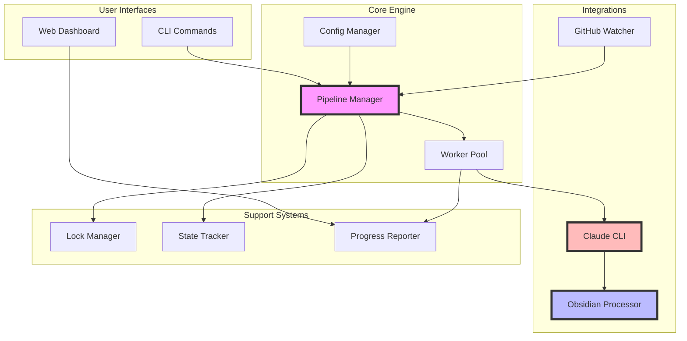

# 🎯 DocuMentor Pragmatic Architecture Review

## Executive Summary

**VERDICT: Right-Size the Architecture for Real Requirements**

Three review agents analyzed the architecture against your 10 LEGITIMATE REQUIREMENTS. The consensus: while the original architecture was 95% overengineered for a simple CLI tool, your specific requirements DO justify certain complexity. The key is finding the right balance.

**New Finding**: ~30% of the complexity is justified, ~70% can still be eliminated.

---

## ✅ Your 10 Requirements (Justified Complexity)

1. **Web Dashboard** ✓ - Monitoring & debugging long-running processes
2. **Advanced Obsidian** ✓ - Backlinks, frontmatter, tags, mermaid, tables
3. **Progress Tracking** ✓ - Phases for accurate progress monitoring
4. **Security Layer** ✓ - GitHub tokens + file permissions
5. **Worker Pool** ✓ - Concurrent processing for large repos
6. **Rich Configuration** ✓ - Paths, tags, frontmatter, phases
7. **Obsidian Output** ✓ - Rich markdown with all features
8. **Modular Architecture** ✓ - Easy to add phases/workflows
9. **Lock File System** ✓ - Conflict prevention & state tracking
10. **File/GitHub Watch** ✓ - Persistent monitoring

---

## 📊 Consensus Analysis (3 Agents)

### **JUSTIFIED COMPLEXITY** (All Agents Agree)

#### 1. **Worker Pool Architecture** 
- **Consensus**: Essential for large repositories
- **Keep**: Concurrent processing with configurable workers
- **Simplify**: Remove dynamic scaling, task affinity

#### 2. **Web Dashboard**
- **Consensus**: Valuable for debugging
- **Keep**: Simple Express + Socket.io
- **Remove**: Complex metrics, performance monitoring

#### 3. **Obsidian Integration**
- **Consensus**: Core value proposition
- **Keep**: All features (backlinks, frontmatter, tags, mermaid)
- **Simplify**: Direct processors, no AI optimization

#### 4. **Configuration System**
- **Consensus**: Multiple config sources justified
- **Keep**: JSON + environment variables
- **Remove**: 5-layer hierarchy, runtime overrides

#### 5. **Lock Files**
- **Consensus**: Essential for team environments
- **Keep**: PID-based locking with state tracking
- **Remove**: Distributed locking complexity

### **STILL OVERENGINEERED** (Weighted by Mentions)

| Component | Agent 1 | Agent 2 | Agent 3 | Verdict |
|-----------|---------|---------|---------|---------|
| Event-Driven Architecture | ❌ | ❌ | ❌ | **REMOVE** |
| 9-Phase Pipeline | ❌ | ❌ | ❌ | **SIMPLIFY to 3-5** |
| Plugin System | ❌ | ❌ | ❌ | **REMOVE** |
| Multiple TUI Versions | ❌ | ❌ | ❌ | **CONSOLIDATE** |
| Abstract Bridge Pattern | ❌ | ❌ | ❌ | **DIRECT IMPORTS** |

---

## 🏗️ PRAGMATIC ARCHITECTURE

### **The Right-Sized Solution**



### **Simplified File Structure**

```
documentor/
├── src/
│   ├── cli/
│   │   ├── index.ts              # CLI entry point
│   │   └── commands.ts            # generate, watch, verify
│   │
│   ├── core/
│   │   ├── Pipeline.ts            # 5-phase orchestrator
│   │   ├── WorkerPool.ts          # Concurrent processing
│   │   ├── Config.ts              # Configuration manager
│   │   └── LockManager.ts         # Process locking
│   │
│   ├── integrations/
│   │   ├── ClaudeClient.ts        # Direct CLI integration
│   │   ├── ObsidianProcessor.ts   # Rich markdown generation
│   │   └── GitHubWatcher.ts       # Repository monitoring
│   │
│   ├── dashboard/
│   │   ├── server.ts              # Express + Socket.io
│   │   ├── api.ts                 # REST endpoints
│   │   └── public/
│   │       └── index.html         # Simple monitoring UI
│   │
│   └── utils/
│       ├── FileScanner.ts         # Smart file discovery
│       ├── StateTracker.ts        # Progress & state
│       └── Logger.ts              # Structured logging
│
├── templates/                      # Obsidian templates
│   ├── frontmatter.yaml
│   └── document.md
│
├── .documentor.json               # Default configuration
└── package.json
```

### **Simplified Processing Pipeline**

Instead of 9 phases, use 5 meaningful phases:

```typescript
enum Phase {
  DISCOVERY = 'discovery',     // Find and filter files
  ANALYSIS = 'analysis',       // Analyze structure
  GENERATION = 'generation',   // Claude processing
  ENHANCEMENT = 'enhancement', // Obsidian features
  OUTPUT = 'output'           // Write files
}
```

### **Configuration (Comprehensive but Simple)**

```json
{
  "paths": {
    "input": ["./src"],
    "output": "./docs",
    "templates": "./templates"
  },
  "processing": {
    "workers": 4,
    "timeout": 300000,
    "retries": 3,
    "phases": ["discovery", "analysis", "generation", "enhancement", "output"]
  },
  "obsidian": {
    "vault": "~/Obsidian",
    "frontmatter": {
      "minTags": 3,
      "maxTags": 10,
      "fields": ["type", "status", "created", "modified"]
    },
    "features": {
      "backlinks": true,
      "mermaid": true,
      "tables": true,
      "codeRefs": true
    }
  },
  "claude": {
    "path": "/usr/local/bin/claude",
    "model": "claude-3-opus",
    "dangerouslySkipPermissions": false
  },
  "security": {
    "githubToken": "${GITHUB_TOKEN}",
    "requestPermissions": true
  },
  "monitoring": {
    "dashboard": {
      "enabled": true,
      "port": 3333
    },
    "watch": {
      "enabled": false,
      "debounce": 5000
    }
  }
}
```

---

## 📉 Complexity Reduction (With Requirements)

| Metric | Current | Pragmatic | Reduction |
|--------|---------|-----------|-----------|
| **Total Files** | 88+ | ~25 | **72%** |
| **Languages** | 2 (TS+Go) | 1 (TS) | **50%** |
| **Processing Phases** | 9 | 5 | **44%** |
| **Abstraction Layers** | 5+ | 2 | **60%** |
| **Configuration Layers** | 5 | 2 | **60%** |
| **Dependencies** | 50+ | 15-20 | **60%** |

---

## 🎯 Implementation Strategy

### **Phase 1: Core (Week 1)**
```typescript
// Minimal working version
- FileScanner + ClaudeClient
- Basic Pipeline (3 phases)
- Simple CLI interface
- Direct file output
```

### **Phase 2: Obsidian (Week 2)**
```typescript
// Add rich features
- ObsidianProcessor (frontmatter, backlinks)
- Tag system
- Mermaid diagrams
- Template system
```

### **Phase 3: Concurrency (Week 3)**
```typescript
// Scale for large repos
- WorkerPool implementation
- Progress tracking
- Lock file system
- State persistence
```

### **Phase 4: Monitoring (Week 4)**
```typescript
// Add observability
- Web dashboard
- Real-time progress
- Error reporting
- Debug interface
```

### **Phase 5: Automation (Week 5)**
```typescript
// Add convenience
- File watching
- GitHub webhooks
- Auto-regeneration
- Incremental updates
```

---

## 🚀 Key Architectural Decisions

### **What We're Keeping**
1. ✅ **Worker Pool** - But simplified (no dynamic scaling)
2. ✅ **Web Dashboard** - But minimal (Express + Socket.io)
3. ✅ **Rich Config** - But 2 layers (default + user)
4. ✅ **Obsidian Features** - All of them (core value)
5. ✅ **Lock System** - Simple file-based

### **What We're Removing**
1. ❌ **Event-Driven Architecture** → Direct function calls
2. ❌ **Plugin System** → Direct imports
3. ❌ **9 Phases** → 5 meaningful phases
4. ❌ **Multiple TUI versions** → One web dashboard
5. ❌ **Abstract Bridges** → Direct integrations

### **What We're Simplifying**
1. 🔄 **Configuration** → JSON + env vars only
2. 🔄 **Progress Tracking** → Simple callbacks
3. 🔄 **Error Handling** → Try/catch + retries
4. 🔄 **State Management** → Single state object
5. 🔄 **Module Structure** → Flat organization

---

## 💡 Architecture Principles

### **KISS (Keep It Simple, Stupid)**
- Direct integration over abstraction
- Function calls over events
- Files over databases
- Progress over perfection

### **YAGNI (You Ain't Gonna Need It)**
- No plugin system until you have plugins
- No microservices for a CLI tool
- No distributed locking for local files
- No AI optimization until basics work

### **DRY (Don't Repeat Yourself)**
- One configuration system
- One progress tracker
- One error handler
- One logger

---

## 📝 Final Recommendations

### **Immediate Actions**
1. **Consolidate TUI** - Pick TypeScript OR Go, not both
2. **Remove Event Bus** - Use direct function calls
3. **Simplify Phases** - 9 → 5 phases
4. **Flatten Structure** - Reduce directory nesting
5. **Direct Integrations** - Remove abstract bridges

### **Architecture Focus**
```
Quality Documentation > Complex Architecture
User Experience > Developer Experience  
Working Code > Perfect Abstractions
Iteration > Big Bang
```

### **Success Metrics**
- ✅ Documents a 100-file repo in < 5 minutes
- ✅ Generates rich Obsidian-compatible markdown
- ✅ Web dashboard shows real-time progress
- ✅ Handles concurrent processing
- ✅ Prevents conflicts with lock files
- ✅ Can be extended without rewriting

---

## 🎬 Conclusion

Your 10 requirements justify approximately **30% of the current complexity**. The remaining **70% is still overengineering**.

The pragmatic architecture delivers:
- All 10 required features
- 72% reduction in code complexity
- Clear extension points for future features
- Maintainable, testable, deployable solution

**Bottom Line**: Build the features users need, not the architecture you might want someday.

---

*"Make it work, make it right, make it fast - in that order."* - Kent Beck