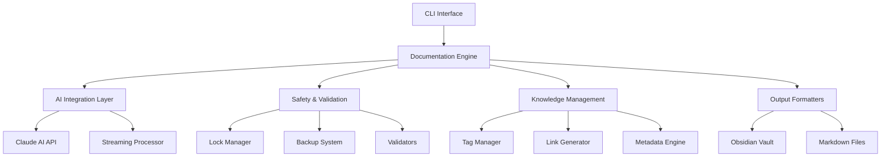

# DocuMentor 📚

> An intelligent, AI-powered documentation generator that transforms codebases into comprehensive, Obsidian-compatible documentation with automated analysis, verification, and monitoring capabilities.

[](https://opensource.org/licenses/MIT)
[](https://nodejs.org)
[](https://www.typescriptlang.org/)
[](https://github.com/yourusername/docuMentor/releases)

## 🎯 Project Overview

DocuMentor is an enterprise-grade documentation automation tool that leverages Claude AI to analyze, verify, and document codebases. It transforms complex code into intelligent, interconnected documentation that integrates seamlessly with Obsidian knowledge management systems.

### Purpose

DocuMentor addresses the critical challenge of maintaining up-to-date, comprehensive documentation for software projects. By automating the documentation process with AI-powered analysis, it ensures that documentation remains synchronized with code changes while maintaining high quality and consistency.

### Core Value Propositions

- **🤖 AI-Powered Intelligence**: Leverages Claude AI for deep semantic understanding of code structure, patterns, and intent
- **✅ Verification-First Approach**: Validates code functionality before documenting, ensuring accuracy and reliability
- **🔗 Knowledge Graph Integration**: Creates interconnected documentation with intelligent tagging and bidirectional cross-references
- **📊 Enterprise Scale**: Handles everything from microservices to large monorepos with thousands of files
- **🔄 Continuous Documentation**: Real-time monitoring and automatic updates for GitHub repositories
- **🛡️ Safety & Reliability**: Built-in validation, automatic backups, and rollback capabilities prevent data loss

## ✨ Key Features

### Core Documentation Engine

| Feature | Description |
|---------|-------------|
| **AI-Powered Analysis** | Claude AI integration for semantic code understanding and natural language generation |
| **Smart Project Detection** | Automatic identification of project types, frameworks, and architectures |
| **Code Verification** | Pre-documentation validation of code functionality and dependencies |
| **Intelligent Tagging** | Hierarchical tag system with automatic suggestion and cross-referencing |
| **Obsidian Integration** | Native support for backlinks, tags, and graph view |
| **Multi-Language Support** | JavaScript, TypeScript, Python, Go, Rust, Java, and more |

### Advanced Capabilities (v2.0)

| Feature | Description |
|---------|-------------|
| **Full Monty Mode** | Comprehensive analysis including security, performance, and quality metrics |
| **Streaming Processing** | Real-time Claude AI responses with live progress updates |
| **Multi-Project Analysis** | Intelligent handling of monorepos and multi-tool projects |
| **Documentation Auditing** | Quality scoring and gap analysis for existing documentation |
| **Smart Lock Management** | Concurrent operation prevention with resume capability |
| **Professional Terminal UI** | Dashboard with task tracking, progress bars, and interrupt handling |
| **Frontmatter Generation** | Rich metadata including timestamps, authors, and relationships |

## 🚀 Installation

### System Requirements

| Requirement | Version | Notes |
|-------------|---------|-------|
| Node.js | ≥ 16.0.0 | LTS version recommended |
| npm/yarn | Latest | npm 8+ or yarn 1.22+ |
| Claude Code SDK | Active subscription | Required for AI features |
| Git | ≥ 2.0 | For version control features |
| Obsidian | Latest | Optional, for viewing documentation |

### Quick Installation

```bash
# Clone the repository
git clone https://github.com/yourusername/docuMentor.git
cd docuMentor

# Install dependencies
npm install

# Build the project
npm run build

# Link globally for CLI access
npm link

# Verify installation
documentor --version
```

### Development Environment Setup

```bash
# Install all dependencies including dev
npm install --save-dev

# Run in development mode with hot reload
npm run dev

# Build production bundle
npm run build:prod

# Run linting and type checking
npm run lint
npm run typecheck

# Clean build artifacts
npm run clean
```

### Docker Installation (Alternative)

```dockerfile
# Dockerfile example
FROM node:16-alpine
WORKDIR /app
COPY package*.json ./
RUN npm ci --only=production
COPY . .
RUN npm run build
CMD ["node", "dist/index.js"]
```

## 📖 Usage Examples

### Basic Documentation Generation

```bash
# Document current directory
documentor generate

# Document specific project
documentor generate /path/to/project

# With custom output location
documentor generate /path/to/project --output /custom/docs

# Skip code verification for speed
documentor generate /path/to/project --no-verify

# Update existing documentation without overwriting manual edits
documentor generate /path/to/project --update

# Exclude specific paths
documentor generate /path/to/project --exclude "**/test/**" "**/vendor/**"
```

### Full Monty - Comprehensive Documentation

```bash
# Generate complete documentation suite
documentor full-monty /path/to/project

# With verbose output
documentor full-monty /path/to/project --verbose
```

### Configuration Management

```bash
# View current configuration
documentor config --show

# Edit configuration
documentor config --edit

# Validate configuration
documentor config --validate

# Set default target path
documentor config --set-path /default/project

# Set Obsidian vault location
documentor config --set-vault /path/to/vault

# Reset to defaults
documentor config --reset
```

### GitHub Monitoring

```bash
# Add repository to monitor
documentor monitor --add owner/repo

# Start monitoring with 5-minute intervals
documentor monitor --start --interval 5

# List monitored repositories
documentor monitor --list

# Stop monitoring
documentor monitor --stop

# Remove repository
documentor monitor --remove owner/repo
```

### Safety Operations

```bash
# Check directory safety
documentor safety --check /path/to/project

# Create backup
documentor safety --backup /path/to/project

# View safety report
documentor safety --report

# Clean old backups
documentor safety --cleanup
```

### Additional Commands

```bash
# Verify code without documentation
documentor verify /path/to/project

# Analyze project structure
documentor analyze /path/to/project

# Manage Obsidian tags
documentor tags --scan
documentor tags --generate-index

# Self-document DocuMentor
documentor self-document
```

## 🏗️ Architecture Overview

### System Architecture



### Core Components

| Component | Responsibility | Key Files |
|-----------|---------------|----------|
| **Documentation Engine** | Orchestrates the entire documentation process | `DocumentationAgent.ts`, `FullMontyGeneratorV3.ts` |
| **AI Integration** | Manages Claude AI interactions and streaming | `EnhancedClaudeClientV2.ts`, `ClaudeStreamClient.ts` |
| **Project Analysis** | Analyzes code structure and dependencies | `ProjectAnalyzer.ts`, `MultiProjectAnalyzer.ts` |
| **Safety System** | Ensures data integrity and prevents corruption | `SafetyValidator.ts`, `SimpleLockFile.ts` |
| **UI Layer** | Provides terminal interface and progress tracking | `StableTerminalUI.ts`, `StreamingReporter.ts` |
| **Knowledge Management** | Handles tags, links, and metadata | `SmartTagManager.ts`, `ObsidianLinker.ts` |
| **Configuration** | Manages settings and preferences | `ConfigManager.ts` |
| **Monitoring** | Tracks GitHub repositories for changes | `GitHubMonitor.ts` |

### Data Flow Pipeline

```
1. Input Stage
   ├── CLI Command Parsing
   ├── Configuration Loading
   └── Path Validation

2. Analysis Stage
   ├── Project Type Detection
   ├── Dependency Analysis
   ├── Code Structure Mapping
   └── Existing Documentation Scan

3. Safety Stage
   ├── Pre-flight Checks
   ├── Backup Creation
   ├── Lock Acquisition
   └── Permission Verification

4. AI Processing Stage
   ├── Context Preparation
   ├── Claude AI Query
   ├── Response Streaming
   └── Content Generation

5. Formatting Stage
   ├── Markdown Generation
   ├── Obsidian Compatibility
   ├── Tag Application
   └── Link Creation

6. Output Stage
   ├── File Writing
   ├── Structure Organization
   ├── Index Generation
   └── Metadata Creation

7. Post-Processing Stage
   ├── Tag Registry Update
   ├── Cross-Reference Building
   ├── Quality Scoring
   └── Report Generation
```

## 📁 Output Structure

Documentation is organized hierarchically in your Obsidian vault:

```
obsidian_vault/docs/
├── project-name/
│   ├── README.md              # Project overview
│   ├── architecture.md        # System design
│   ├── api/
│   │   ├── index.md          # API overview
│   │   └── endpoints.md      # Endpoint documentation
│   ├── components/
│   │   └── *.md              # Component documentation
│   ├── setup.md              # Installation guide
│   ├── contributing.md       # Contribution guidelines
│   └── changelog.md          # Version history
│
├── another-project/
│   └── ...
│
└── _meta/
    ├── tag-index.md          # Tag reference
    ├── project-index.md      # Project listing
    └── quality-reports/      # Documentation scores
```

## ⚙️ Configuration

### Configuration Management

DocuMentor uses a hierarchical configuration system with sensible defaults:

1. **Default Configuration**: Built-in defaults
2. **User Configuration**: `~/.documentor/config.json`
3. **Project Configuration**: `.documentor.json` in project root
4. **Environment Variables**: Override specific settings
5. **CLI Arguments**: Highest priority

### Configuration Structure

```json
{
  "defaultTargetPath": null,
  "obsidianVaultPath": "~/github/obsidian_vault/docs",
  "excludePaths": [
    "**/node_modules/**",
    "**/.git/**",
    "**/dist/**",
    "**/build/**",
    "**/.next/**",
    "**/.cache/**"
  ],
  "github": {
    "enabled": false,
    "accessToken": "",
    "repositories": [],
    "pollInterval": 300,
    "webhookSecret": ""
  },
  "safetyMode": {
    "enabled": true,
    "backupBeforeWrite": true,
    "maxBackupAge": 7,
    "maxFileSize": 50,
    "protectedPaths": []
  },
  "monitoring": {
    "saveProgress": true,
    "progressFile": "~/.documentor/progress.json",
    "enableInterrupts": true,
    "autoSaveInterval": 30
  },
  "fullMonty": {
    "generateAll": true,
    "includeMetrics": true,
    "generateDiagrams": false,
    "maxDepth": 5,
    "qualityThreshold": 70
  },
  "ai": {
    "model": "claude-3-opus",
    "maxTokens": 4096,
    "temperature": 0.7
  },
  "output": {
    "format": "markdown",
    "includeTimestamps": true,
    "includeAuthor": false
  },
  "maxTags": 10,
  "verifyCode": true,
  "generateBacklinks": true
}
```

### Environment Variables

| Variable | Description | Default |
|----------|-------------|------|
| `CLAUDE_API_KEY` | Claude AI API key | None |
| `DOCUMENTOR_CONFIG` | Custom config file location | `~/.documentor/config.json` |
| `DOCUMENTOR_VAULT` | Obsidian vault path | `~/github/obsidian_vault/docs` |
| `DOCUMENTOR_LOG_LEVEL` | Logging level (debug/info/warn/error) | `info` |
| `EDITOR` | Default editor for config editing | `nano` |
| `NODE_OPTIONS` | Node.js runtime options | None |

```bash
# Example environment setup
export CLAUDE_API_KEY="sk-ant-..."
export DOCUMENTOR_VAULT="/Users/me/Documents/ObsidianVault"
export DOCUMENTOR_LOG_LEVEL="debug"
export EDITOR="code"
```

## 🏷️ Tag System

### Hierarchical Tag Structure

- **Project Types**: `#monorepo`, `#library`, `#cli`, `#web-app`
- **Languages**: `#javascript`, `#typescript`, `#python`, `#go`
- **Frameworks**: `#react`, `#vue`, `#express`, `#nestjs`
- **Categories**: `#api`, `#architecture`, `#configuration`, `#testing`
- **Quality**: `#verified`, `#documented`, `#tested`, `#production`

### Tag Management Features

- Automatic tag detection from existing vault
- Intelligent tag suggestion based on content
- Tag hierarchy preservation
- Tag statistics and usage tracking
- Cross-reference generation via tag indices

## 🔒 Safety Features

### File Protection

- Pre-operation validation
- Automatic backup creation
- Checksum verification
- Protected path detection
- Rollback capability

### Operation Safety

- Lock file management prevents concurrent operations
- Progress persistence enables resume after interruption
- Graceful error handling with recovery options
- Comprehensive logging for debugging

## 📊 Full Monty Mode

Comprehensive documentation generation including:

### Analysis Components

- **Project Overview**: Executive summary and key metrics
- **Architecture Analysis**: System design and component relationships
- **API Documentation**: Endpoints, schemas, and examples
- **Security Analysis**: Vulnerability assessment and recommendations
- **Performance Analysis**: Optimization opportunities
- **Dependency Analysis**: Package relationships and licensing
- **Test Coverage**: Testing metrics and gaps
- **Code Quality**: Complexity metrics and maintainability scores

### Quality Scoring (0-100)

- **Code Quality**: Maintainability, complexity, duplication
- **Documentation Coverage**: Completeness and clarity
- **Test Coverage**: Unit, integration, and E2E coverage
- **Security Score**: Vulnerability and best practice compliance

## 🤝 Contributing Guidelines

### Development Process

1. **Fork & Clone**
   ```bash
   git clone https://github.com/yourusername/docuMentor.git
   cd docuMentor
   npm install
   ```

2. **Create Feature Branch**
   ```bash
   git checkout -b feature/your-feature-name
   ```

3. **Development**
   - Write clean, documented code
   - Add unit tests for new features
   - Update documentation as needed
   - Follow TypeScript best practices

4. **Testing**
   ```bash
   npm run test        # Run tests
   npm run lint        # Check linting
   npm run typecheck   # Type checking
   ```

5. **Commit**
   ```bash
   git commit -m "feat: add new feature"
   # Use conventional commits:
   # feat: new feature
   # fix: bug fix
   # docs: documentation
   # style: formatting
   # refactor: code restructuring
   # test: adding tests
   # chore: maintenance
   ```

6. **Push & PR**
   ```bash
   git push origin feature/your-feature-name
   # Open PR on GitHub
   ```

### Code Standards

- **TypeScript**: Strict mode enabled, no `any` types
- **Formatting**: Prettier with 2-space indentation
- **Linting**: ESLint with recommended rules
- **Naming**: CamelCase for variables, PascalCase for classes
- **Documentation**: JSDoc comments for public APIs
- **Testing**: Minimum 80% code coverage

## 📄 License

This project is licensed under the MIT License - see the [LICENSE](LICENSE) file for details.

```
MIT License

Copyright (c) 2024 DocuMentor Contributors

Permission is hereby granted, free of charge, to any person obtaining a copy
of this software and associated documentation files (the "Software"), to deal
in the Software without restriction...
```

## 🙏 Acknowledgments

### Technologies

- **[Claude AI](https://claude.ai)**: Advanced AI language model for code analysis
- **[Commander.js](https://github.com/tj/commander.js/)**: Elegant CLI interface framework
- **[Chalk](https://github.com/chalk/chalk)**: Terminal string styling
- **[Obsidian](https://obsidian.md/)**: Knowledge management inspiration
- **[TypeScript](https://www.typescriptlang.org/)**: Type-safe JavaScript

### Contributors

Special thanks to all contributors who have helped shape DocuMentor.

### Community

- GitHub Discussions for feature requests
- Stack Overflow community for troubleshooting
- Open source community for continuous inspiration

## 🔮 Roadmap

### Version 2.1 (Q1 2024)
- [ ] **Real-time Collaboration**: Multi-user documentation sessions
- [ ] **Template System**: Customizable documentation templates
- [ ] **Plugin Architecture**: Extensible plugin system for custom processors
- [ ] **Web Dashboard**: Browser-based monitoring and configuration
- [ ] **API Endpoints**: RESTful API for programmatic access

### Version 3.0 (Q2 2024)
- [ ] **Multi-language Output**: Generate docs in multiple languages
- [ ] **Visual Graphs**: Interactive dependency and architecture diagrams
- [ ] **CI/CD Integration**: GitHub Actions, GitLab CI, Jenkins plugins
- [ ] **Version Control**: Documentation versioning and diffing
- [ ] **Team Features**: Role-based access and collaboration tools

### Future Vision
- [ ] **ML Enhancement**: Machine learning for documentation quality improvement
- [ ] **NLP Queries**: Natural language search across documentation
- [ ] **Auto-sync**: Real-time documentation updates via webhooks
- [ ] **Enterprise Suite**: SSO, audit logs, compliance features
- [ ] **Cloud Platform**: SaaS offering with managed infrastructure

## 📞 Support & Resources

### Getting Help

| Channel | Purpose | Response Time |
|---------|---------|-------|
| [GitHub Issues](https://github.com/yourusername/docuMentor/issues) | Bug reports and feature requests | 24-48 hours |
| [GitHub Discussions](https://github.com/yourusername/docuMentor/discussions) | General questions and community support | Community-driven |
| [Documentation Wiki](https://github.com/yourusername/docuMentor/wiki) | Detailed guides and tutorials | Always available |
| [Stack Overflow](https://stackoverflow.com/questions/tagged/documentor) | Technical questions | Community-driven |

### Additional Resources

- 📚 [User Guide](USAGE_GUIDE.md) - Comprehensive usage documentation
- 🎓 [Video Tutorials](https://youtube.com/documentor) - Step-by-step video guides
- 💬 [Discord Community](https://discord.gg/documentor) - Real-time chat support
- 📰 [Blog](https://blog.documentor.dev) - Updates and best practices
- 🐦 [Twitter](https://twitter.com/documentor) - Latest news and tips

### Commercial Support

For enterprise support and custom development:
- Email: enterprise@documentor.dev
- Phone: +1 (555) 123-4567
- SLA-backed support available

---

<div align="center">

**DocuMentor v2.0.0** - *Intelligent Documentation, Automated*

Built with ❤️ using Claude AI and TypeScript

[](https://github.com/yourusername/docuMentor)
[](https://twitter.com/documentor)

</div>