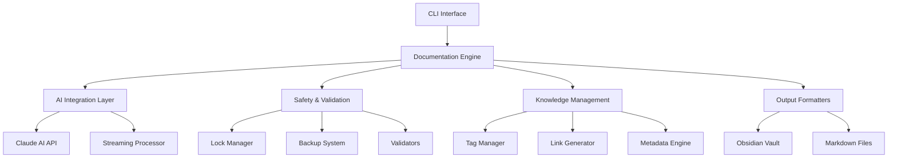

# DocuMentor

> 🤖 AI-powered documentation generator with Obsidian integration, real-time progress tracking, and comprehensive code analysis

[](https://github.com/docuMentor)
[](https://nodejs.org)
[](https://www.typescriptlang.org/)
[](https://golang.org/)
[](LICENSE)

## 📖 Project Overview

DocuMentor is an intelligent documentation generation system that leverages Claude AI to analyze codebases and produce comprehensive, well-structured documentation. It seamlessly integrates with Obsidian for knowledge management, provides real-time progress tracking through a Go-based TUI, and ensures documentation quality through code verification and safety validation.

### Core Purpose
- **Automated Documentation**: Transform any codebase into comprehensive documentation
- **Knowledge Management**: Direct integration with Obsidian vaults for organized documentation
- **Quality Assurance**: Verify code functionality and maintain documentation accuracy
- **Developer Experience**: Real-time progress tracking with an intuitive terminal interface

## ✨ Key Features

### 🎯 Documentation Generation
- **AI-Powered Analysis**: Uses Claude AI for intelligent code understanding
- **Multi-Format Support**: Generate documentation in Markdown with Obsidian-specific formatting
- **Project Type Detection**: Automatically identifies project frameworks and languages
- **Comprehensive Coverage**: Creates API docs, architecture diagrams, and usage guides

### 🔗 Obsidian Integration
- **Native Compatibility**: Full support for Obsidian backlinks, tags, and frontmatter
- **Smart Tagging**: Intelligent tag hierarchy and consolidation
- **Cross-References**: Automatic generation of document relationships
- **Vault Management**: Direct output to configured Obsidian vaults

### 📊 Progress & Monitoring
- **Go TUI Dashboard**: Real-time visual progress tracking
- **Interrupt Handling**: Safe interruption with state preservation
- **Lock File System**: Resume interrupted documentation sessions
- **Streaming Processing**: Efficient handling of large codebases

### 🔒 Safety & Validation
- **Code Verification**: Validates documented functionality
- **Safety Checks**: File integrity and permission validation
- **Backup System**: Automatic backups before modifications
- **Sensitive Data Protection**: Scans for and protects sensitive information

### 🌐 GitHub Integration
- **Repository Monitoring**: Track changes and auto-document commits
- **Pull Request Analysis**: Document PR changes and impacts
- **Issue Tracking**: Link documentation to GitHub issues
- **Continuous Documentation**: Keep docs in sync with code changes

## 🚀 Installation

### Prerequisites
```bash
# Required
- Node.js >= 16.0.0
- npm or yarn
- Go >= 1.20 (for TUI)

# Optional
- Obsidian (for viewing generated documentation)
- GitHub account (for repository monitoring)
```

### Quick Install
```bash
# Clone the repository
git clone https://github.com/yourusername/docuMentor.git
cd docuMentor

# Install Node.js dependencies
npm install

# Build TypeScript
npm run build

# Build Go TUI (optional but recommended)
cd src/tui
go mod download
go build -o documentor-tui main.go updateInfoBox.go password_modal_simple.go
cd ../..

# Make launcher executable
chmod +x documentor

# Link globally (optional)
npm link
```

## 📚 Usage Examples

### Basic Documentation Generation
```bash
# Document current directory
documentor generate

# Document specific project
documentor generate /path/to/project

# Specify output location
documentor generate /path/to/project -o ~/obsidian/vault/docs
```

### Advanced Features
```bash
# Comprehensive documentation with metrics
documentor full-monty /path/to/project

# Verify code without generating docs
documentor verify /path/to/project

# Monitor GitHub repository
documentor monitor --add owner/repo --start

# Configure settings
documentor config --show
documentor config --set-vault ~/obsidian/vault
```

### Self-Documentation
```bash
# Generate documentation for DocuMentor itself
documentor self-document
```

### Safety Operations
```bash
# Check directory safety
documentor safety --check /path/to/project

# Create backup
documentor safety --backup /path/to/project

# View safety report
documentor safety --report
```


## 🏗️ Architecture Overview

### System Architecture



### Core Components

| Component | Responsibility | Key Files |
|-----------|---------------|----------|
| **Documentation Engine** | Orchestrates the entire documentation process | `DocumentationAgent.ts`, `FullMontyGeneratorV3.ts` |
| **AI Integration** | Manages Claude AI interactions and streaming | `EnhancedClaudeClientV2.ts`, `ClaudeStreamClient.ts` |
| **Project Analysis** | Analyzes code structure and dependencies | `ProjectAnalyzer.ts`, `MultiProjectAnalyzer.ts` |
| **Safety System** | Ensures data integrity and prevents corruption | `SafetyValidator.ts`, `SimpleLockFile.ts` |
| **UI Layer** | Provides terminal interface and progress tracking | `StableTerminalUI.ts`, `StreamingReporter.ts` |
| **Knowledge Management** | Handles tags, links, and metadata | `SmartTagManager.ts`, `ObsidianLinker.ts` |
| **Configuration** | Manages settings and preferences | `ConfigManager.ts` |
| **Monitoring** | Tracks GitHub repositories for changes | `GitHubMonitor.ts` |

### Data Flow Pipeline

```
1. Input Stage
   ├── CLI Command Parsing
   ├── Configuration Loading
   └── Path Validation

2. Analysis Stage
   ├── Project Type Detection
   ├── Dependency Analysis
   ├── Code Structure Mapping
   └── Existing Documentation Scan

3. Safety Stage
   ├── Pre-flight Checks
   ├── Backup Creation
   ├── Lock Acquisition
   └── Permission Verification

4. AI Processing Stage
   ├── Context Preparation
   ├── Claude AI Query
   ├── Response Streaming
   └── Content Generation

5. Formatting Stage
   ├── Markdown Generation
   ├── Obsidian Compatibility
   ├── Tag Application
   └── Link Creation

6. Output Stage
   ├── File Writing
   ├── Structure Organization
   ├── Index Generation
   └── Metadata Creation

7. Post-Processing Stage
   ├── Tag Registry Update
   ├── Cross-Reference Building
   ├── Quality Scoring
   └── Report Generation
```

## 📁 Output Structure

Documentation is organized hierarchically in your Obsidian vault:

```
obsidian_vault/docs/
├── project-name/
│   ├── README.md              # Project overview
│   ├── architecture.md        # System design
│   ├── api/
│   │   ├── index.md          # API overview
│   │   └── endpoints.md      # Endpoint documentation
│   ├── components/
│   │   └── *.md              # Component documentation
│   ├── setup.md              # Installation guide
│   ├── contributing.md       # Contribution guidelines
│   └── changelog.md          # Version history
│
├── another-project/
│   └── ...
│
└── _meta/
    ├── tag-index.md          # Tag reference
    ├── project-index.md      # Project listing
    └── quality-reports/      # Documentation scores
```

## ⚙️ Configuration

### Configuration Management

DocuMentor uses a hierarchical configuration system with sensible defaults:

1. **Default Configuration**: Built-in defaults
2. **User Configuration**: `~/.documentor/config.json`
3. **Project Configuration**: `.documentor.json` in project root
4. **Environment Variables**: Override specific settings
5. **CLI Arguments**: Highest priority

### Configuration Structure

```json
{
  "defaultTargetPath": null,
  "obsidianVaultPath": "~/github/obsidian_vault/docs",
  "excludePaths": [
    "**/node_modules/**",
    "**/.git/**",
    "**/dist/**",
    "**/build/**",
    "**/.next/**",
    "**/.cache/**"
  ],
  "github": {
    "enabled": false,
    "accessToken": "",
    "repositories": [],
    "pollInterval": 300,
    "webhookSecret": ""
  },
  "safetyMode": {
    "enabled": true,
    "backupBeforeWrite": true,
    "maxBackupAge": 7,
    "maxFileSize": 50,
    "protectedPaths": []
  },
  "monitoring": {
    "saveProgress": true,
    "progressFile": "~/.documentor/progress.json",
    "enableInterrupts": true,
    "autoSaveInterval": 30
  },
  "fullMonty": {
    "generateAll": true,
    "includeMetrics": true,
    "generateDiagrams": false,
    "maxDepth": 5,
    "qualityThreshold": 70
  },
  "ai": {
    "model": "claude-3-opus",
    "maxTokens": 4096,
    "temperature": 0.7
  },
  "output": {
    "format": "markdown",
    "includeTimestamps": true,
    "includeAuthor": false
  },
  "maxTags": 10,
  "verifyCode": true,
  "generateBacklinks": true
}
```

### Environment Variables

| Variable | Description | Default |
|----------|-------------|------|
| `CLAUDE_API_KEY` | Claude AI API key | None |
| `DOCUMENTOR_CONFIG` | Custom config file location | `~/.documentor/config.json` |
| `DOCUMENTOR_VAULT` | Obsidian vault path | `~/github/obsidian_vault/docs` |
| `DOCUMENTOR_LOG_LEVEL` | Logging level (debug/info/warn/error) | `info` |
| `EDITOR` | Default editor for config editing | `nano` |
| `NODE_OPTIONS` | Node.js runtime options | None |

```bash
# Example environment setup
export CLAUDE_API_KEY="sk-ant-..."
export DOCUMENTOR_VAULT="/Users/me/Documents/ObsidianVault"
export DOCUMENTOR_LOG_LEVEL="debug"
export EDITOR="code"
```

## 🏷️ Tag System

### Hierarchical Tag Structure

- **Project Types**: `#monorepo`, `#library`, `#cli`, `#web-app`
- **Languages**: `#javascript`, `#typescript`, `#python`, `#go`
- **Frameworks**: `#react`, `#vue`, `#express`, `#nestjs`
- **Categories**: `#api`, `#architecture`, `#configuration`, `#testing`
- **Quality**: `#verified`, `#documented`, `#tested`, `#production`

### Tag Management Features

- Automatic tag detection from existing vault
- Intelligent tag suggestion based on content
- Tag hierarchy preservation
- Tag statistics and usage tracking
- Cross-reference generation via tag indices

## 🔒 Safety Features

### File Protection

- Pre-operation validation
- Automatic backup creation
- Checksum verification
- Protected path detection
- Rollback capability

### Operation Safety

- Lock file management prevents concurrent operations
- Progress persistence enables resume after interruption
- Graceful error handling with recovery options
- Comprehensive logging for debugging

## 📊 Full Monty Mode

Comprehensive documentation generation including:

### Analysis Components

- **Project Overview**: Executive summary and key metrics
- **Architecture Analysis**: System design and component relationships
- **API Documentation**: Endpoints, schemas, and examples
- **Security Analysis**: Vulnerability assessment and recommendations
- **Performance Analysis**: Optimization opportunities
- **Dependency Analysis**: Package relationships and licensing
- **Test Coverage**: Testing metrics and gaps
- **Code Quality**: Complexity metrics and maintainability scores

### Quality Scoring (0-100)

- **Code Quality**: Maintainability, complexity, duplication
- **Documentation Coverage**: Completeness and clarity
- **Test Coverage**: Unit, integration, and E2E coverage
- **Security Score**: Vulnerability and best practice compliance

## 🤝 Contributing Guidelines

### Development Setup
```bash
# Fork and clone
git clone https://github.com/yourusername/docuMentor.git
cd docuMentor

# Install dependencies
npm install

# Development mode
npm run dev

# Run tests
npm test
```

### Code Style
- **TypeScript**: Follow strict type checking
- **Go**: Use standard Go formatting (gofmt)
- **Commits**: Use conventional commit messages
- **Documentation**: Update docs for new features

### Contribution Process
1. **Fork** the repository
2. **Create** a feature branch (`git checkout -b feature/amazing-feature`)
3. **Commit** changes (`git commit -m 'feat: Add amazing feature'`)
4. **Push** to branch (`git push origin feature/amazing-feature`)
5. **Open** a Pull Request

### Areas for Contribution
- 🐛 Bug fixes and issue resolution
- ✨ New documentation formats
- 🎨 TUI improvements and themes
- 📝 Documentation enhancements
- 🧪 Test coverage expansion
- 🔧 Performance optimizations

## 📄 License

This project is licensed under the MIT License - see the [LICENSE](LICENSE) file for details.

## 🙏 Acknowledgments

- [Claude AI](https://anthropic.com) for powering intelligent analysis
- [Obsidian](https://obsidian.md) for inspiration on knowledge management
- [tview](https://github.com/rivo/tview) for the Go TUI framework
- Community contributors and users


## 📞 Support

- **Issues**: [GitHub Issues](https://github.com/yourusername/docuMentor/issues)
- **Discussions**: [GitHub Discussions](https://github.com/yourusername/docuMentor/discussions)
- **Documentation**: [Full Documentation](docs/)

---

*Built with ❤️ by the DocuMentor team*